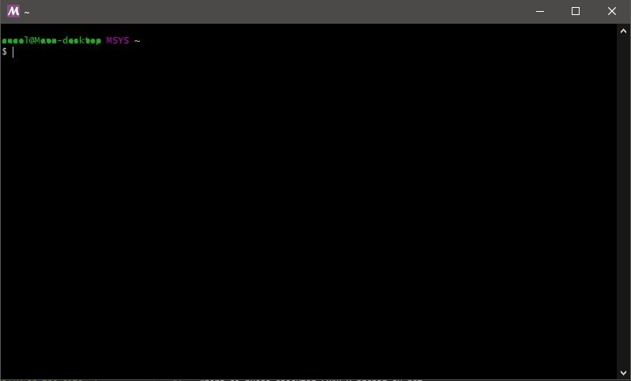
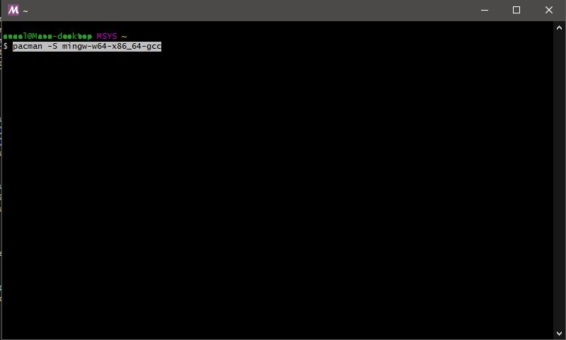
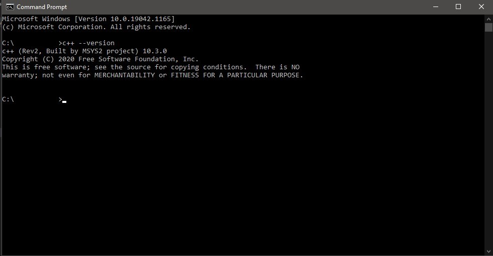
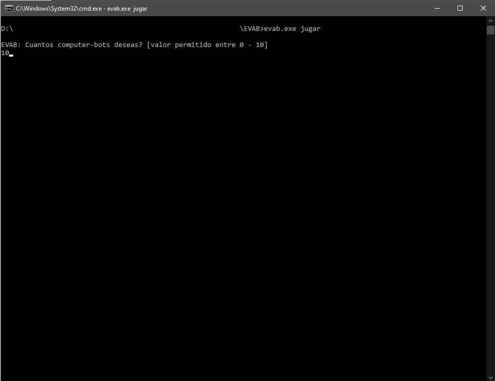

# Instalación en Windows

## Requisitos:

- Compilador MinGW GCC 10.3.0 (Built by MSYS2 project)

## Instalación de C++ 10.3.0

Si no tuvieras el requisito de gcc 10.3.0 sigue los siguientes pasos, sino salta a la parte de "Ejecución de EVAB".

- Primero descargaremos MSYS desde su [página oficial](https://www.msys2.org/)
- Instala el archivo descargado (msys2-x86_64-20210725.exe).
- Ejecuta el programa "MSYS2 MSYS" (es el que acabas de instalar).
- Deberías tener algo como esta imagen:

- Ahora ejecuta el siguiente comando:
  ```bash
  $ pacman -S mingw-w64-x86_64-gcc
  ```

- Te pedirá confirmar la instalación, escribe "y" y dale enter.
- Ahora vamos a confirmar que hemos instalado la version de c++ 10.3.0 correctamente abriendo
un "Símbolo de sistema" o "Command Prompt" (según tu idioma). Ejecuta el siguiente comando.
  ```bash
  $ c++ --version
  ```
Deberías ver algo así. En caso no, vuelve a hacer los pasos nuevamente o contáctanos para ayudarte.


## Ejecución de EVAB

EVAB es portable, así que no requiere un procedimiento de instalación pero sí debe tomar en cuenta que los archivos de los bots participantes
se compilan cuando ejecute EVAB. 
Para descargar EVAB usa el siguiente [enlace](../../assets/EVAB/EVAB_Win64.zip).<br>
Habrás descargado un archivo .zip el cual debes descomprimir. Al descomprimir verás la carpeta "EVAB", ingresa en él. Ahora abre un "Símbolo de sistema" con esta ubicación y ejecuta:
  ```bash
  $ evab.exe jugar
  ```
Ahora elige un número cualquiera entre 2 y 10. Dale enter y deberías ver un juego ejecutándose automáticamente.



Ahora ve a "Guías" a aprender los demás comandos y empezar a programar tu bot.
