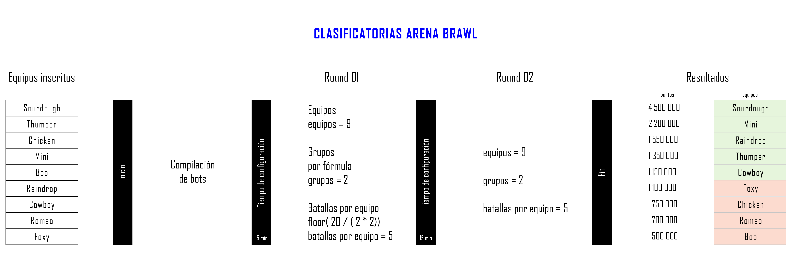
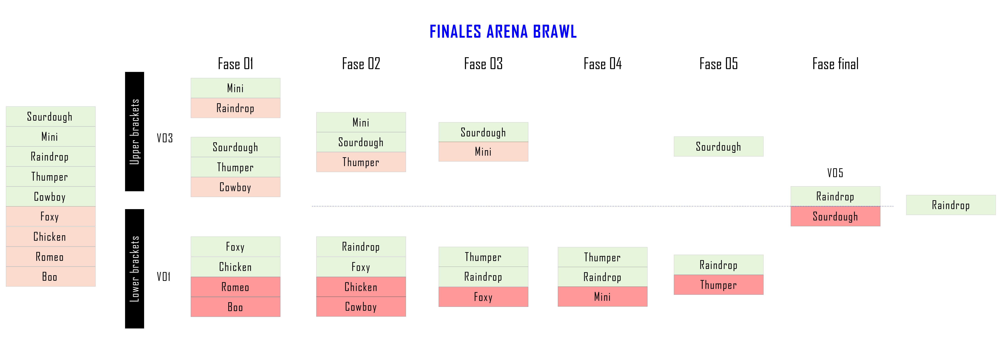

# Arena Brawl 2021

## Formato del torneo

El torneo se divide en 2 etapas que corresponden a 02 fechas, semifinales y finales. 

#### Etapa semifinales

Esta primera fecha de semifinales tiene por objetivo ubicarte en las [Upper o Lower brackets](https://britishesports.org/news/what-are-the-different-tournament-formats-in-esports/)
 de la etapa final. Todos los equipos
pasan a la etapa final pero según tu resultado irás a diferente bracket.
Para las batallas de semifinales agruparemos de forma aleatoria a todos los equipos en grupos.
Estos grupos estarán conformados de mínimo 02 equipos y máximo de 10. La cantidad de grupos viene determinada de la siguiente forma:

```cpp
int CantidadGrupos(int equipos) {
  if (equipos >= 1 && equipos <= 10) return 2;
  if (equipos > 10) return static_cast<int>(ceil(equipos/10));
}
```

La etapa de semifinales tiene la siguiente agenda:

|                                       Agenda de semifinales                                                      |
|:-----------------------------------:|:--------------------------------------------------------------------------:|
| I.   Compilación de bots            |         Según cantidad de equipos                                          |
| II.  Configuración de bots          |         15 minutos.                                                        |
| III. Primera ronda                  |         Mínimo 01 batalla por participante y máximo 10 batallas.           |
| IV.  Configuración de bots          |         15 minutos.                                                        |
| V.   Segunda ronda                  |         Mínimo 01 batalla por participante y máximo 10 batallas.           |

Es nuestro objetivo que como mínimo tengas una batalla por ronda, pero es posible que te enfrentes a más. Si se da el caso, la suma de todos
tus resultados (de primera y segunda ronda) determinarán tu bracket en la etapa final. También debes saber que todas las batallas de semifinales
se formarán aleatoriamente.

La cantidad de batallas por ronda que tendrás se determinará de la siguiente manera:

```cpp
int CantidadDeBatallasPorRonda(int grupos) {
  return static_cast<int>(floor( 20 / (grupos * 2)));
}
```

"Compilación de bots" es el momento donde compilaremos todos los bots en el servidor donde se ejecutará el evento. 
Después de este momento, tendrás 15 minutos si acaso tuviste algún problema. Luego, empieza la "Primera ronda".
El segundo momento de "Configuración de bots" úsalo estratégicamente.

¿Qué equipos pasarán a las Upper y Lower brackets?

```cpp
void LowerAndUpperBrackets(int equipos) {
  std::cout << "Upper brackets: " << ceil(equipos/2) << "equipos con mayor puntaje" << std::endl;
  std::cout << "Lower brackets: " << floor(equipos/2) << "equipos con menor puntaje"<< std::endl;
}
```

Ejemplo:



#### Etapa finales

En esta segunda fecha de finales se determinará al ganador del Arena Brawl. 
Según si estás ubicado en las Upper o Lower brackets, cada batalla se determinará [BO3](https://blog.sportkeepers.com/que-significa-bo1-bo3-y-bo5-en-esports/) en caso de Upper Brackets y [BO1](https://blog.sportkeepers.com/que-significa-bo1-bo3-y-bo5-en-esports/) para las Lower Brackets.

Para determinar cuántos grupos por brackets habrá, se utilizará la siguiente fórmula:

```cpp
int CantidadGruposUpperB(int equipos) {
  if (equipos >= 1 && equipos <= 3) return 1;
  if (equipos > 3 && equipos <= 10) return 2;
  if (equipos > 10) return static_cast<int>(ceil(equipos/10));
  else exit (EXIT_FAILURE);
}

int CantidadGruposLowerB(int equipos) {
  if (equipos >= 1 && equipos <= 10) return 1;
  if (equipos > 10) return static_cast<int>(ceil(equipos/10));
  else exit (EXIT_FAILURE);
}
```

Los ganadores de cada batalla se determinará de la siguiente forma:

```cpp
void GanadoresYPerdedores(int equipos) {
  std::cout << "Ganador(es): " << ceil(equipos/2) << std::endl;
  std::cout << "Perdedor(es): " << floor(equipos/2) << std::endl;
}
```

Esta fecha de finales se divide en fases y en cada fase tendremos:

 - *Upper brackets*, donde los ganadores pasan a la siguiente fase y los perdedores pasan a Lower brackets.
 - *Lower brackets*, donde los ganadores pasan a la siguiente fase de Lower brackets y los perdedores son eliminados.

La cantidad de fases dependerá del número de equipos, los cuales batallarán hasta llegar a la fase final que será 1 vs 1 (modalidad [BO5](https://blog.sportkeepers.com/que-significa-bo1-bo3-y-bo5-en-esports/)).

Ejemplo:



## Puntaje obtenido por batalla

Estos puntajes te serán otorgados una vez acabe la batalla y determinará tu posición. En caso de que la batalla sea BO3 o BO5, el puntaje final que determina tu posición será
la suma acumulada por batalla.

|                    Suceso                    | Bonificación en puntos |
|:--------------------------------------------:|:----------------------:|
| Mantenerte vivo hasta el final de la batalla.|        1,000,000       |
| Por cada nave destrozada.                    |         100,000        |
| Por cada vida restante.                      |         10,000         |
| Por cada munición restante.                  |           10           |
| Por destrozar primero a una nave.            |            1           |
